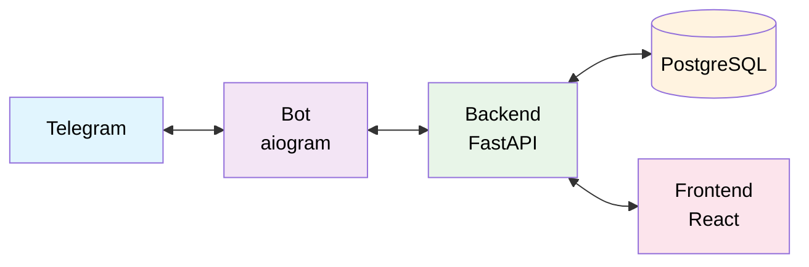

# IHearYou Bot — Telegram-бот для семей с детьми с нарушенным слухом

Общедоступный Telegram-бот для предоставления целевой аудитории простого и удобного инструмента для навигации по обширной библиотеке материалов организации АНО "Я тебя слышу".

## 🎯 Цель проекта

Информационно-навигационный бот для структуризации и доставки существующего контента (статьи, видео, PDF) к пользователю с возможностью сбора статистики для улучшения поддержки.

## 🏗️ Архитектура



**Компоненты:**
- `bot/` — Telegram-бот на aiogram для взаимодействия с пользователями
- `backend/` — FastAPI-сервис с админ-панелью и REST API
- `frontend/` — React SPA для администраторов

## 🚀 Ключевые функции

### Для пользователей
- **Приветствие и выбор пути** — выбор между "Я волнуюсь о слухе ребенка" / "о своем слухе"
- **Древовидное меню** — структурированная навигация по материалам
- **Поиск по ключевым словам** — быстрый поиск нужной информации
- **Оценка полезности** — система оценок материалов (1-5 звезд)
- **Напоминания** — тактичные напоминания неактивным пользователям каждые 10 дней
- **Мультимедиа контент** — тексты, фото, видео (YouTube/VK), PDF документы

### Для администраторов
- **Админ-панель** — полноценное веб-управление контентом
- **CRUD операции** — создание, редактирование, удаление материалов
- **Модерация вопросов** — просмотр и ответы на вопросы пользователей
- **Аналитика** — статистика использования разделов и оценок материалов
- **Управление пользователями** — просмотр активности и данных пользователей

## 🛠️ Технологический стек

- **Backend:** FastAPI, SQLAlchemy, PostgreSQL, Redis
- **Bot:** aiogram 3.x, aiohttp, httpx
- **Frontend:** React, Vite
- **Инфраструктура:** Docker, Docker Compose
- **Инструменты:** Poetry, Ruff, pytest, Alembic

## ⚡ Быстрый старт

### Через Docker (рекомендуется)

```bash
# Клонирование репозитория
git clone git@github.com:Shpindik/Ihearyou_bot.git
cd Ihearyou_bot

# Настройка переменных окружения
cp .env.example .env
# Отредактируйте .env файл, добавив BOT_TOKEN

# Запуск всех сервисов
make dev
# или
docker-compose up -d --build
```

### Через Makefile

```bash
# Первоначальная настройка
make setup

# Быстрый старт для разработки
make dev

# Просмотр логов
make logs
```

## 🌐 Доступные сервисы

После запуска будут доступны:
- **API Backend:** http://localhost:8001
- **API Документация:** http://localhost:8001/docs
- **Frontend:** http://localhost:3001
- **Health Check:** http://localhost:8001/health

## 📋 Переменные окружения

Основные переменные (полный список в README компонентов):

```bash
# Telegram Bot
BOT_TOKEN=your-telegram-bot-token

# База данных
DATABASE_URL=postgresql+asyncpg://postgres:postgres@db:5432/ihearyou

# Администратор
ADMIN_USERNAME=admin
ADMIN_PASSWORD=admin12345
ADMIN_EMAIL=admin@example.com

# API
BOT_API_PORT=8001
JWT_SECRET_KEY=your-secret-key
```

## 📚 Документация компонентов

- [Backend API](backend/README.md) — FastAPI сервис, админ-панель, REST API
- [Bot](bot/README.md) — Telegram-бот на aiogram
- [Frontend](frontend/README.md) — React админ-панель

## 🎨 Особенности дизайна

- **Простота интерфейса** — интуитивно понятная навигация через кнопки
- **Тактичность** — мягкий, дружелюбный тон общения
- **Производительность** — мгновенный отклик бота
- **Масштабируемость** — архитектура готова к росту пользователей и платной подписке

## 🔧 Разработка

```bash
# Установка зависимостей
make install-dev

# Запуск тестов
make run-tests

# Форматирование кода
make run-format

# Применение миграций
make migrate

# Загрузка тестовых данных
make load-data
```

## 👥 Команда проекта

### Управление
- **Product Manager:** Синдицкая Евгения — [eugeshia](https://t.me/eugeshia) | esinditskaya@gmail.com
- **Project Manager:** Оксана Хамаза — [oksana016](https://t.me/oksana016) | khamaza.oksana@gmail.com

### Команда Дизайн
- **Куцак Ника Игоревна** — [iwrbiss](https://t.me/iwrbiss) | kucaknika661@gmail.com
- **Ремарк Александра Андреевна** — [thundermonster](https://t.me/thundermonster) | remarkaleksandra@gmail.com

### Команда Python
- **Чунина Александра Сергеевна** — [noisejam](https://t.me/noisejam) | alexandra.chunina@gmail.com
- **Карпов Тимофей Евгеньевич** — [timofey_the_hiker](https://t.me/timofey_the_hiker) | timofey@the-hiker.ru
- **Жердецкий Андрей** — [a_n_s_e_z](https://t.me/a_n_s_e_z) | aszherdetskiy@gmail.com
- **Прокофьев Александр Алексеевич** — [Shp1ndik](https://t.me/Shp1ndik) | kuisajke@gmail.com
- **Башкатов Валентин Александрович** — [bashvalen](https://t.me/bashvalen) | bashkatovvala@gmail.com

### Команда Web
- **Денис Боровец** — [borove4ik](https://t.me/borove4ik) | dsborovets@gmail.com
- **Даниленко Екатерина Алексеевна** — [ketrin_dan](https://t.me/ketrin_dan) | katerina.dan07@gmail.com
- **Проскурина Ирина Сергеевна** — [IrinkaProskurina](https://t.me/IrinkaProskurina) | proskurin4343@gmail.com
- **Виссаров Василий Анатольевич** — [prayftorespect](https://t.me/prayftorespect) | vissar2016@gmail.com

## 🔒 Безопасность

- JWT аутентификация для админ-панели
- Хеширование паролей
- Валидация всех входных данных
- Защищенное хранение пользовательских данных
